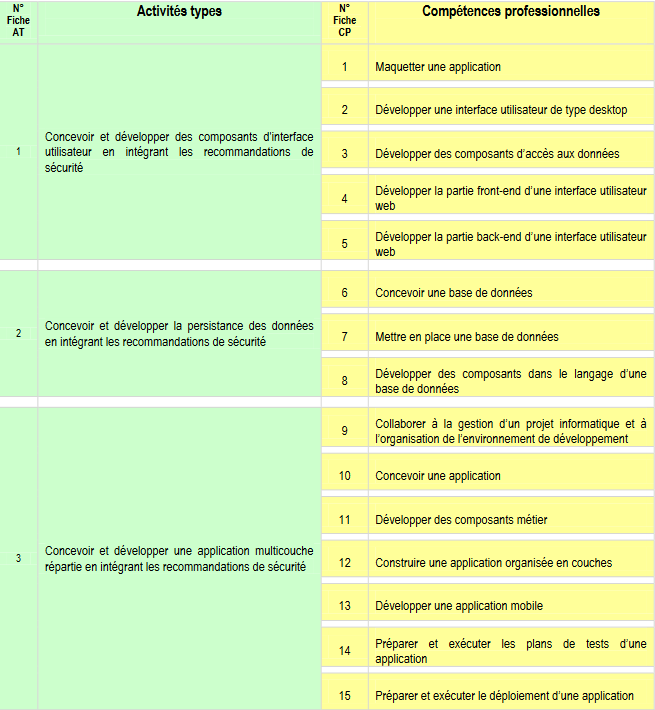

# Dossier-projet-Calories-Tracker

Cette plateforme a pour but de centraliser des infos de manière collaborative autour de langages et de technologies web, favorisant également la veille techno et l’ouverture d’esprit au travers de différents articles liés à ce domaine.

## Sommaire

1. [Liste des compétences du référentiel qui sont couvertes par le projet](#liste-des-competences-du-referentiel-couvertes-par-le-projet-calories-tracker)
2. [Cahier des charges](./cahier-des-charges/)
3. [Résumé du projet](./gestion-de-projet/)
4. [Gestion de projet](./gestion-de-projet/)
5. [Spécifications fonctionnelles](./specifications-fonctionnelles/)
6. [Spécifications techniques](./specifications-techniques/)
7. [Réalisations](./realisations/)
8. [Présentation du jeu d’essai](./presentation-jeu-essai/)
9. [Veille](./veille/)
10. [Description d’une situation de travail ayant nécessité une recherche](./)

## Liste des competences du referentiel couvertes par le projet Calories Tracker

